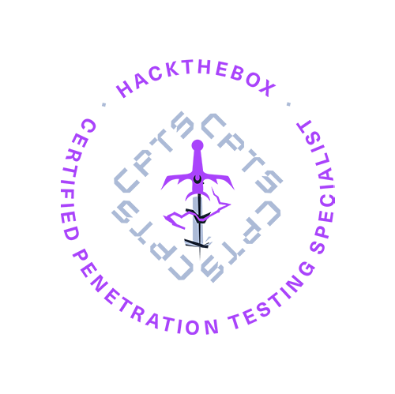

# oscp-cpts-notes

    
    

Notes for OSCP & HTB CPTS

## Enhance your reading experience with my GitBook [https://notes.sushilpoudel.com.np/](https://notes.sushilpoudel.com.np/)

### Solution of the Questions and Skill Assessment are not published due to HTB Terms and Condition 

If you are having problem with question or skill assessment, contact me here

_**Instagram**_ [_dollarboysushil_](https://instagram.com/dollarboysushil)\
_**Twitter (X)**_ [_dollarboysushil_](https://twitter.com/dollarboysushil)\
_**Youtube**_ [_dollarboysushil_](https://youtube.com/dollarboysushil)\
_**Linkedin**_ [_dollarboysushil_](https://www.linkedin.com/in/dollarboysushil/)\
_**Discord**_ [_https://discord.gg/5jpkdeV_](https://discord.gg/5jpkdeV)
