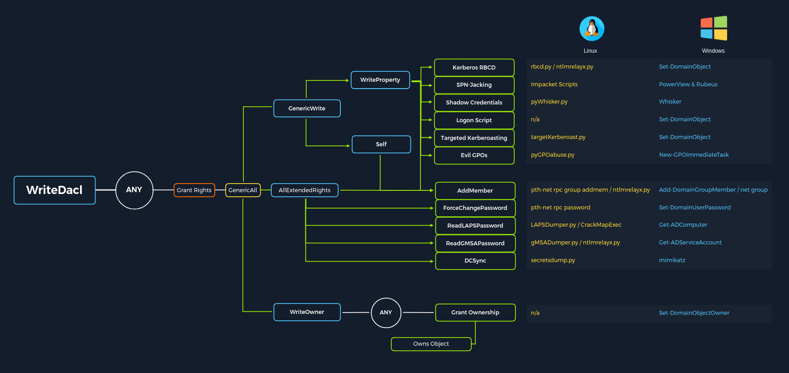
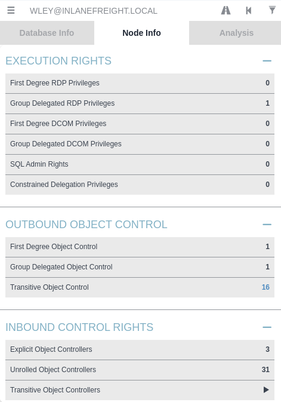
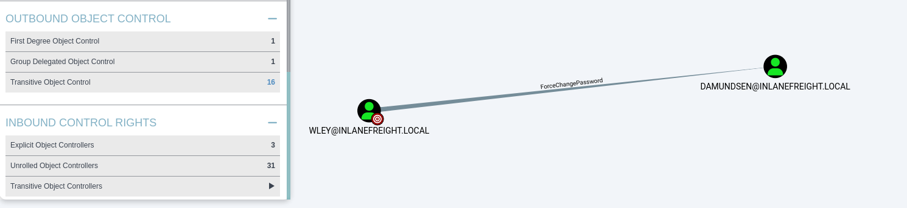
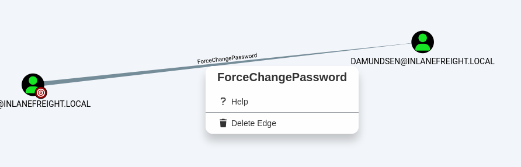
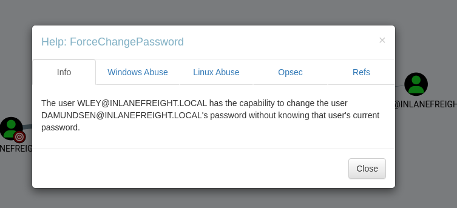
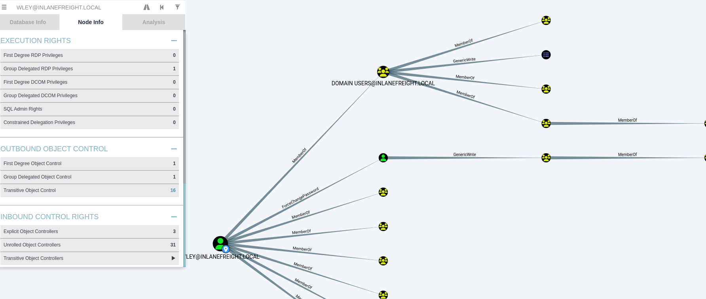

# An ACE in the Hole


Access Control List (ACL) Abuse Primer

ACL are list that defines

* Who has access to which asset/resources
* the level of access they are provisioned.

The settings themselves in an ACL are called `Access Control Entries` (`ACEs`)

<figure><figcaption></figcaption></figure>

## ACL Enumeration

## **Using PowerView**

* `PS C:\\htb> Import-Module .\\PowerView.ps1`
* `PS C:\\htb> $sid = Convert-NameToSid wley` → Getting SID of the target user.
* `PS C:\\htb> Get-DomainObjectACL -ResolveGUIDs -Identity * | ? {$_.SecurityIdentifier -eq $sid}`

```powershell
PS C:\\htb> Get-DomainObjectACL -ResolveGUIDs -Identity * | ? {$_.SecurityIdentifier -eq $sid} AceQualifier           : AccessAllowed
ObjectDN               : CN=Dana Amundsen,OU=DevOps,OU=IT,OU=HQ-NYC,OU=Employees,OU=Corp,DC=INLANEFREIGHT,DC=LOCAL
ActiveDirectoryRights  : ExtendedRight
ObjectAceType          : User-Force-Change-Password
ObjectSID              : S-1-5-21-3842939050-3880317879-2865463114-1176
InheritanceFlags       : ContainerInherit
BinaryLength           : 56
AceType                : AccessAllowedObject
ObjectAceFlags         : ObjectAceTypePresent
IsCallback             : False
PropagationFlags       : None
SecurityIdentifier     : S-1-5-21-3842939050-3880317879-2865463114-1181
AccessMask             : 256
AuditFlags             : None
IsInherited            : False
AceFlags               : ContainerInherit
InheritedObjectAceType : All
OpaqueLength           : 0
```

This shows, user wley has User-Force-Change-Password over user damundsen

Further enumerating rights of damundsen

* `PS C:\\htb> $sid2 = Convert-NameToSid damundsen`
* `PS C:\\htb> Get-DomainObjectACL -ResolveGUIDs -Identity * | ? {$_.SecurityIdentifier -eq $sid2} -Verbose`

```
PS C:\htb> $sid2 = Convert-NameToSid damundsenPS C:\htb> Get-DomainObjectACL -ResolveGUIDs -Identity * | ? {$_.SecurityIdentifier -eq $sid2} -VerboseAceType               : AccessAllowed
ObjectDN              : CN=Help Desk Level 1,OU=Security Groups,OU=Corp,DC=INLANEFREIGHT,DC=LOCAL
ActiveDirectoryRights : ListChildren, ReadProperty, GenericWrite
OpaqueLength          : 0
ObjectSID             : S-1-5-21-3842939050-3880317879-2865463114-4022
InheritanceFlags      : ContainerInherit
BinaryLength          : 36
IsInherited           : False
IsCallback            : False
PropagationFlags      : None
SecurityIdentifier    : S-1-5-21-3842939050-3880317879-2865463114-1176
AccessMask            : 131132
AuditFlags            : None
AceFlags              : ContainerInherit
AceQualifier          : AccessAllowed
```

This shows user damundsen has GenericWrite privileges over the Help Desk Level 1 Group.


## **Enumerating ACLs with BloodHound**

Import the file from ingestor

in search box, search for the user we have control `wley` in this case.

<figure><figcaption></figcaption></figure>

In Node info tab, we can use the `Outbound Object Control section`

<figure><figcaption></figcaption></figure>

we can see `wley` has `force change password` over the user `damundsen` user

<figure><figcaption></figcaption></figure>

we can then right click on the line, which gives us help option

<figure><figcaption></figcaption></figure>

which shows help around abusing this ACE

<figure><figcaption></figcaption></figure>

we can get whole attack path from Transitive Object Control Section
